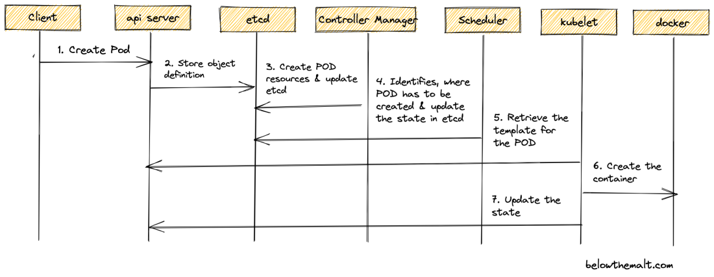

# POD

Plus petite unité applicative dans K8s.
Les containers qu'il contient partage la meme stack reseau (via localhost) / stockage (via volumes).
Chaque pod a une @IP dediées et se base sur une specification (Yaml) qui définit les containers qui s'exécuteront dans le pod
On peut voir un pod comme un applicatif métier d'une application;
En générale un pod contiendra une seule application métier mais il existe des patterns qui permettent d'associer des applications d'outillage à l'application principale: side car pattern.

## Cycle de vie 


https://belowthemalt.com/2022/04/08/kubernetes-cluster-process-flow-of-a-pod-creation/

```bash
kubectl create -f <pod_specification>.yaml
kubectl apply -f wordpress_pod.yml #exemple
kubectl run <pod_name> --image=<image_name>
```

## suppression 

```bash
kubectl delete pod <pod_name>
```

## liste des pods (par defautl seulement les namespace default)

```bash
kubectl get pod
```

## Editer la spec

```bash
kubectl edit pod <pod_name>
```

## Afficher la spec

```bash
kubectl run redis --image<image_name> --dry-run!client -o yaml
```

## Description d'un pod

```bash
kubctl describe pod <pod_name>
kubctl describe po/<pod_name>
```

## logs

```bash
kubectl logs <pod_name> [-c <container_name>]
```

Si il y a plusieurs replicas, la commande logs choisira arbitrairement un pod

```bash
kubectl logs <pod_name> [-c <container_name>] --follow --tail 1
```

N.B la commande , combinée aux labels permet d'afficher les logs de plusieurs pods.

## shell interactive

```bash
kubectl exec <pod_name> -t -i [-c  <container_name>] -- command
kubectl exec -ti www-594bc6dfc7-k48kh -- sh #exemple
```

## forward de port (publier un port sur la machine hote)

```bash
kubectl port-forward <pod_name> <host_port>:<container_port>
```

## Container pause

PRésent sur chaque POD mais cachés par défaut.
Il a pour but d'établir les CGroups, réservations et namespaces avant que les containers soient créés.

```bash
docker ps -a | grep -I pause
```

https://docs.mirantis.com/mke/3.4/ref-arch/pause-containers.html

N.B chaque pod communique via son @IP

N.B Un Volume est lié au cycle de vie du POD et non du container => Si le Container tombe , il n'entrain pas avec lui le volume
